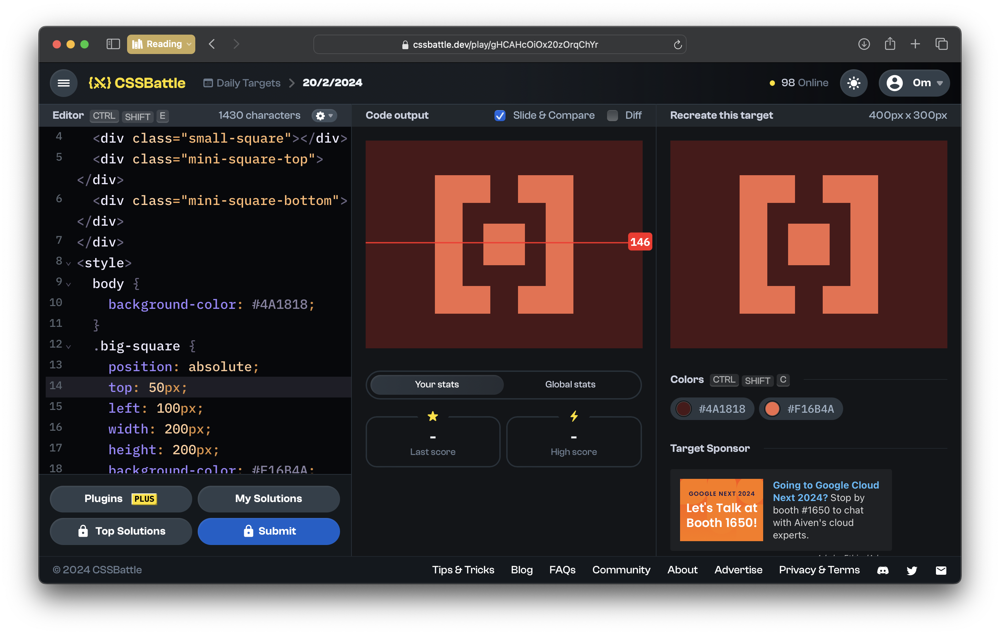

# CSSBattle Results - February 20, 2024

## Date: February 20, 2024

### Screenshots

#### Result Screen



#### CSS Photo


### HTML Code

```html
<div>
  <div class="big-square"></div>
  <div class="medium-square"></div>
  <div class="small-square"></div>
  <div class="mini-square-top"></div>
  <div class="mini-square-bottom"></div>
</div>
<style>
  body {
    background-color: #4a1818;
  }
  .big-square {
    position: absolute;
    top: 50px;
    left: 100px;
    width: 200px;
    height: 200px;
    background-color: #f16b4a;
  }
  .medium-square {
    position: absolute;
    top: 90px;
    left: 140px;
    width: 120px;
    height: 120px;
    background-color: #4a1818;
  }
  .small-square {
    position: absolute;
    top: 120px;
    left: 170px;
    width: 60px;
    height: 60px;
    background-color: #f16b4a;
  }
  .mini-square-top {
    position: absolute;
    top: 50px;
    left: 180px;
    width: 40px;
    height: 40px;
    background-color: #4a1818;
  }
  .mini-square-bottom {
    position: absolute;
    bottom: 50px;
    left: 180px;
    width: 40px;
    height: 40px;
    background-color: #4a1818;
  }
</style>
```
