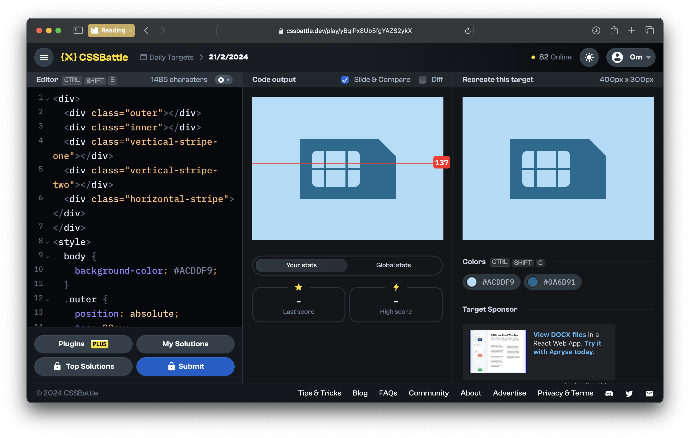

# CSSBattle Results - February 21, 2024

## Date: February 21, 2024

## Instructions

```html
<!-- OBJECTIVE -->
<!-- Write HTML/CSS in this editor and replicate the given target image in the least code possible. What you write here, renders as it is -->

<!-- SCORING -->
<!-- The score is calculated based on the number of characters you use (this comment included :P) and how close you replicate the image. Read the FAQS (https://cssbattle.dev/faqs) for more info. -->

<!-- IMPORTANT: remove the comments before submitting -->
```

### Screenshots

#### Result Screen



#### CSS Photo


### HTML Code

```html
<div>
  <div class="outer"></div>
  <div class="inner"></div>
  <div class="vertical-stripe-one"></div>
  <div class="vertical-stripe-two"></div>
  <div class="horizontal-stripe"></div>
</div>
<style>
  body {
    background-color: #acddf9;
  }
  .outer {
    position: absolute;
    top: 88px;
    left: 100px;
    width: 200px;
    height: 125px;
    clip-path: polygon(82.3% 0, 100% 28.3%, 100% 100%, 0 100%, 0 0);
    background: #0a6b91;
  }
  .inner {
    position: absolute;
    top: 113px;
    left: 125px;
    width: 100px;
    height: 75px;
    border-radius: 10px;
    background: #acddf9;
  }
  .vertical-stripe-one {
    position: absolute;
    top: 113px;
    left: 150px;
    width: 5px;
    height: 75px;
    background: #0a6b91;
  }
  .vertical-stripe-two {
    position: absolute;
    top: 113px;
    left: 195px;
    width: 5px;
    height: 75px;
    background: #0a6b91;
  }
  .horizontal-stripe {
    position: absolute;
    top: 148px;
    left: 125px;
    width: 100px;
    height: 5px;
    background: #0a6b91;
  }
</style>
```
