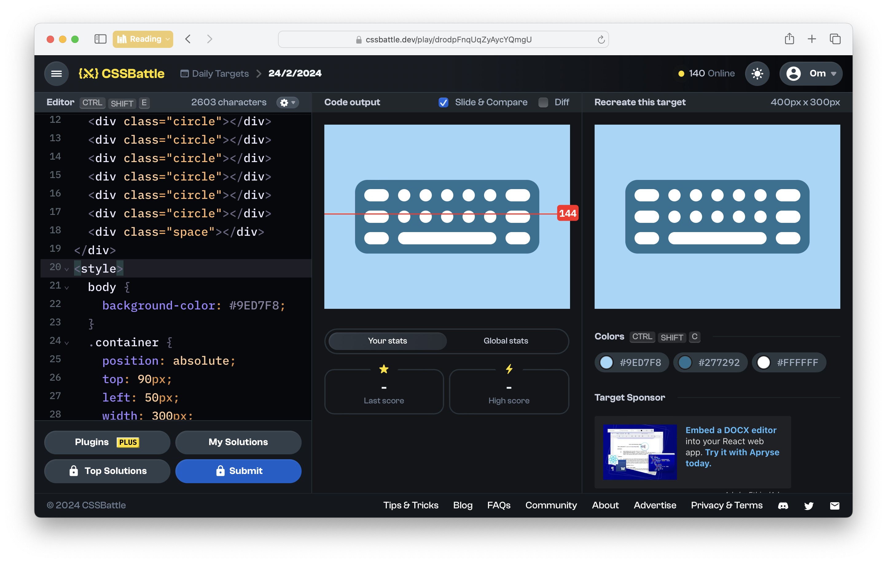
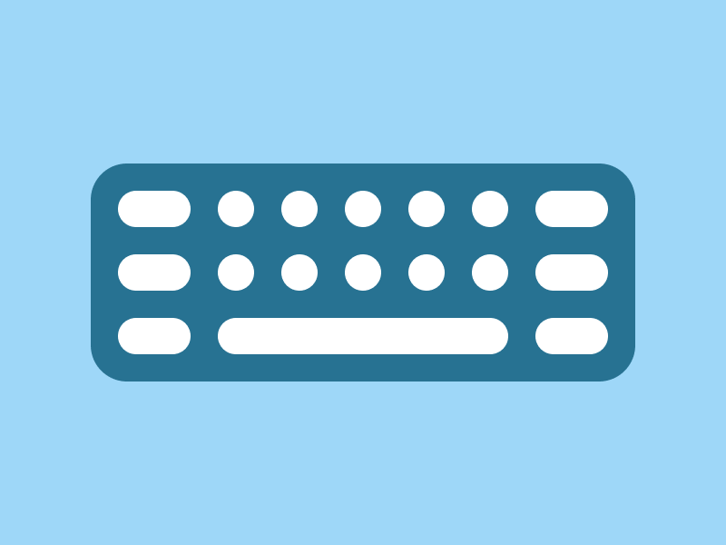

# CSSBattle Results - February 24, 2024

## Date: February 24, 2024

## Instructions

```html
<!-- OBJECTIVE -->
<!-- Write HTML/CSS in this editor and replicate the given target image in the least code possible. What you write here, renders as it is -->

<!-- SCORING -->
<!-- The score is calculated based on the number of characters you use (this comment included :P) and how close you replicate the image. Read the FAQS (https://cssbattle.dev/faqs) for more info. -->

<!-- IMPORTANT: remove the comments before submitting -->
```

### Screenshots

#### Result Screen



#### CSS Photo



### HTML Code

```html
<div class="container">
  <div class="medium"></div>
  <div class="medium"></div>
  <div class="medium"></div>
  <div class="medium"></div>
  <div class="medium"></div>
  <div class="medium"></div>
  <div class="circle"></div>
  <div class="circle"></div>
  <div class="circle"></div>
  <div class="circle"></div>
  <div class="circle"></div>
  <div class="circle"></div>
  <div class="circle"></div>
  <div class="circle"></div>
  <div class="circle"></div>
  <div class="circle"></div>
  <div class="space"></div>
</div>
<style>
  body {
    background-color: #9ed7f8;
  }
  .container {
    position: absolute;
    top: 90px;
    left: 50px;
    width: 300px;
    height: 120px;
    border-radius: 20px;
    background: #277292;
  }
  .medium {
    position: absolute;
    width: 40px;
    height: 20px;
    border-radius: 10px;
    background: #ffffff;
  }
  .medium:nth-of-type(1) {
    top: 15px;
    left: 15px;
  }
  .medium:nth-of-type(2) {
    top: 50px;
    left: 15px;
  }
  .medium:nth-of-type(3) {
    top: 85px;
    left: 15px;
  }
  .medium:nth-of-type(4) {
    top: 15px;
    right: 15px;
  }
  .medium:nth-of-type(5) {
    top: 50px;
    right: 15px;
  }
  .medium:nth-of-type(6) {
    top: 85px;
    right: 15px;
  }
  .circle {
    position: absolute;
    width: 20px;
    height: 20px;
    border-radius: 50%;
    background: #ffffff;
  }
  .circle:nth-of-type(7) {
    top: 15px;
    left: 70px;
  }
  .circle:nth-of-type(8) {
    top: 15px;
    left: 105px;
  }
  .circle:nth-of-type(9) {
    top: 15px;
    right: 70px;
  }
  .circle:nth-of-type(10) {
    top: 15px;
    right: 105px;
  }
  .circle:nth-of-type(11) {
    top: 15px;
    right: 140px;
  }
  .circle:nth-of-type(12) {
    top: 50px;
    right: 140px;
  }
  .circle:nth-of-type(13) {
    top: 50px;
    right: 105px;
  }
  .circle:nth-of-type(14) {
    top: 50px;
    right: 70px;
  }
  .circle:nth-of-type(15) {
    top: 50px;
    left: 105px;
  }
  .circle:nth-of-type(16) {
    top: 50px;
    left: 70px;
  }
  .space {
    position: absolute;
    top: 85px;
    left: 70px;
    width: 160px;
    height: 20px;
    border-radius: 10px;
    background: #ffffff;
  }
</style>
```
