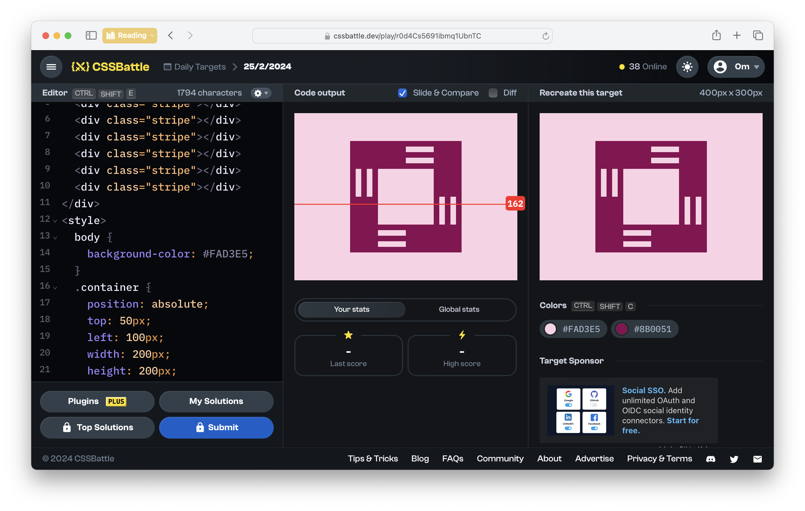

# CSSBattle Results - February 25, 2024

## Date: February 25, 2024

## Instructions

```html
<!-- OBJECTIVE -->
<!-- Write HTML/CSS in this editor and replicate the given target image in the least code possible. What you write here, renders as it is -->

<!-- SCORING -->
<!-- The score is calculated based on the number of characters you use (this comment included :P) and how close you replicate the image. Read the FAQS (https://cssbattle.dev/faqs) for more info. -->

<!-- IMPORTANT: remove the comments before submitting -->
```

### Screenshots

#### Result Screen



#### CSS Photo


### HTML Code

```html
<div class="container">
  <div class="square"></div>
  <div class="stripe"></div>
  <div class="stripe"></div>
  <div class="stripe"></div>
  <div class="stripe"></div>
  <div class="stripe"></div>
  <div class="stripe"></div>
  <div class="stripe"></div>
  <div class="stripe"></div>
</div>
<style>
  body {
    background-color: #fad3e5;
  }
  .container {
    position: absolute;
    top: 50px;
    left: 100px;
    width: 200px;
    height: 200px;
    background: #8b0051;
  }
  .square {
    position: absolute;
    top: 50px;
    left: 50px;
    width: 100px;
    height: 100px;
    background: #fad3e5;
  }
  .stripe {
    position: absolute;
    width: 50px;
    height: 10px;
    background: #fad3e5;
  }
  .stripe:nth-of-type(2) {
    top: 10px;
    left: 100px;
  }
  .stripe:nth-of-type(3) {
    top: 30px;
    left: 100px;
  }
  .stripe:nth-of-type(4) {
    bottom: 10px;
    right: 100px;
  }
  .stripe:nth-of-type(5) {
    bottom: 30px;
    right: 100px;
  }
  .stripe:nth-of-type(6) {
    top: 70px;
    left: -10px;
    transform: rotate(90deg);
  }
  .stripe:nth-of-type(7) {
    top: 70px;
    left: 10px;
    transform: rotate(90deg);
  }
  .stripe:nth-of-type(8) {
    top: 120px;
    right: 10px;
    transform: rotate(90deg);
  }
  .stripe:nth-of-type(9) {
    top: 120px;
    right: -10px;
    transform: rotate(90deg);
  }
</style>
```
