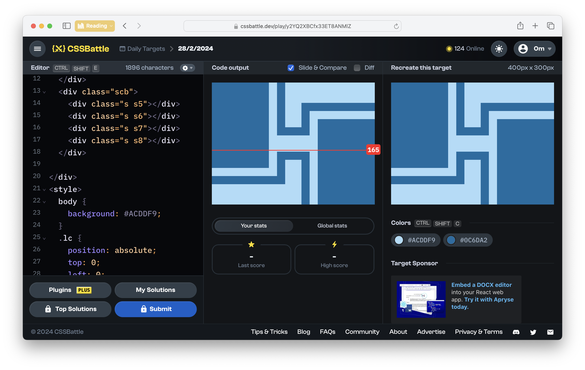

# CSSBattle Results - February 28, 2024

## Date: February 28, 2024

## Instructions

```html
<!-- OBJECTIVE -->
<!-- Write HTML/CSS in this editor and replicate the given target image in the least code possible. What you write here, renders as it is -->

<!-- SCORING -->
<!-- The score is calculated based on the number of characters you use (this comment included :P) and how close you replicate the image. Read the FAQS (https://cssbattle.dev/faqs) for more info. -->

<!-- IMPORTANT: remove the comments before submitting -->
```

### Screenshots

#### Result Screen



#### CSS Photo


### HTML Code

```html
<div>
  <div class="bs lc"></div>
  <div class="sc">
    <div class="s s1"></div>
    <div class="s s2"></div>
    <div class="s s3"></div>
    <div class="s s4"></div>
  </div>
</div>
<div>
  <div class="bs rc"></div>
  <div class="scb">
    <div class="s s5"></div>
    <div class="s s6"></div>
    <div class="s s7"></div>
    <div class="s s8"></div>
  </div>
</div>
<style>
  body {
    background: #acddf9;
  }
  .lc {
    position: absolute;
    top: 0;
    left: 0;
  }
  .bs {
    width: 140px;
    height: 210px;
    background: #0c6da2;
  }
  .rc {
    position: absolute;
    bottom: 0;
    right: 0;
  }
  .sc {
    position: absolute;
    top: 0px;
    left: 160px;
    right: 0;
  }
  .s {
    position: absolute;
    width: 20px;
    height: 130px;
    background: #0c6da2;
  }

  .s1 {
    top: 0;
    left: 0px;
  }
  .s4 {
    height: 60px;
    top: 70;
    left: 60px;
  }
  .s3 {
    height: 60px;
    rotate: 90deg;
    top: 90;
    right: 200;
  }
  .s2 {
    height: 180px;
    rotate: 90deg;
    top: -30px;
    right: 80;
  }
  .scb {
    position: absolute;
    bottom: 0px;
    right: 160px;
    left: 0;
    /* background: red;
    width: 240px;
    height: 130px; */
  }
  .s5 {
    bottom: 0;
    right: 0px;
  }
  .s6 {
    height: 180px;
    rotate: 90deg;
    bottom: -30px;
    left: 80;
  }
  .s7 {
    height: 60px;
    rotate: 90deg;
    bottom: 90;
    left: 200;
  }
  .s8 {
    height: 60px;
    bottom: 70;
    right: 60px;
  }
</style>
```
