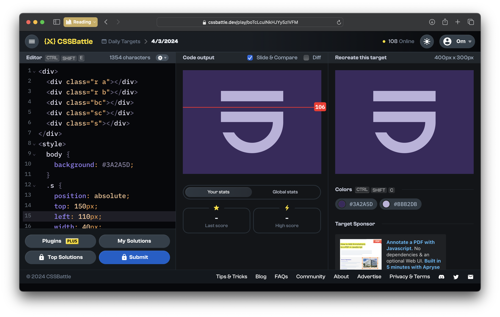

# CSSBattle Results - March 04, 2024

## Date: March 04, 2024

### Screenshots

#### Result Screen



#### CSS Photo


### HTML Code

```html
<div>
  <div class="r a"></div>
  <div class="r b"></div>
  <div class="bc"></div>
  <div class="sc"></div>
  <div class="s"></div>
</div>
<style>
  body {
    background: #3a2a5d;
  }
  .s {
    position: absolute;
    top: 150px;
    left: 110px;
    width: 40px;
    height: 30px;
    background: #3a2a5d;
  }
  .r {
    position: absolute;
    width: 180px;
    height: 30px;
    background: #bbb2db;
  }
  .a {
    top: 60px;
    left: 110px;
  }
  .b {
    top: 120px;
    left: 110px;
  }
  .bc {
    position: absolute;
    top: 150px;
    left: 110px;
    width: 180px;
    height: 90px;
    border-bottom-left-radius: 90px;
    border-bottom-right-radius: 90px;
    background: #bbb2db;
  }
  .sc {
    position: absolute;
    top: 150px;
    left: 140px;
    width: 120px;
    height: 60px;
    border-bottom-left-radius: 100px;
    border-bottom-right-radius: 100px;
    background: #3a2a5d;
  }
</style>
```
