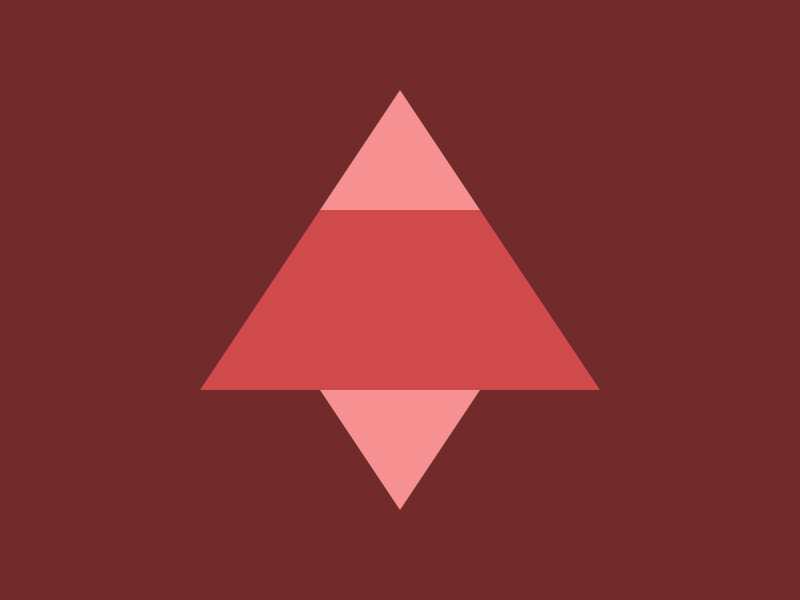

# CSSBattle Results - March 09, 2024

## Date: March 09, 2024

### Screenshots

#### Result Screen


#### CSS Photo



### HTML Code

```html
<div>
  <div class="t b l"></div>
  <div class="t s l"></div>
  <div class="t r l"></div>
</div>
<style>
  body {
    background: #712b2b;
  }
  .t {
    position: absolute;
    width: 80px;
    height: 60px;
    clip-path: polygon(50% 0%, 0% 100%, 100% 100%);
    background: #f79091;
  }
  .l {
    left: 160px;
  }
  .r {
    transform: rotate(180deg);
    bottom: 45px;
  }
  .b {
    transform: scale(2.5);
    top: 90px;
    background: #d04a4c;
  }
  .s {
    top: 45px;
  }
</style>
```
