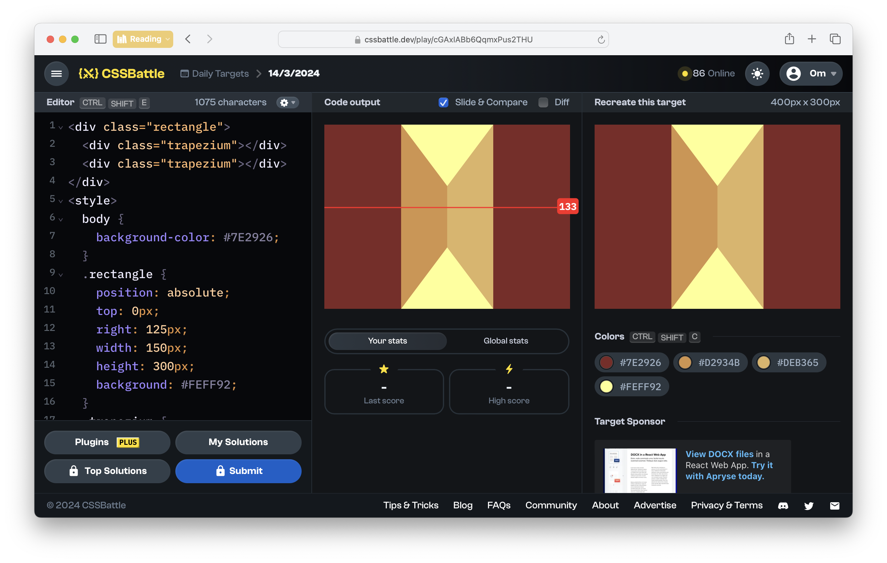
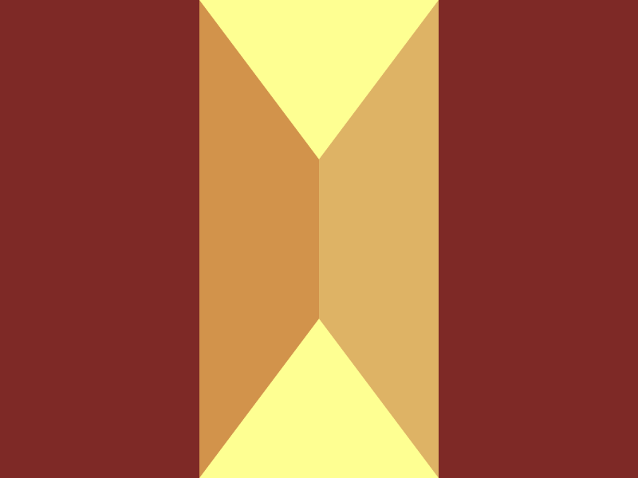

# CSSBattle Results - March 14, 2024

## Date: March 14, 2024

## Instructions

```html
<!-- OBJECTIVE -->
<!-- Write HTML/CSS in this editor and replicate the given target image in the least code possible. What you write here, renders as it is -->

<!-- SCORING -->
<!-- The score is calculated based on the number of characters you use (this comment included :P) and how close you replicate the image. Read the FAQS (https://cssbattle.dev/faqs) for more info. -->

<!-- IMPORTANT: remove the comments before submitting -->
```

### Screenshots

#### Result Screen



#### CSS Photo



### HTML Code

```html
<div class="rectangle">
  <div class="trapezium"></div>
  <div class="trapezium"></div>
</div>
<style>
  body {
    background-color: #7e2926;
  }
  .rectangle {
    position: absolute;
    top: 0px;
    right: 125px;
    width: 150px;
    height: 300px;
    background: #feff92;
  }
  .trapezium {
    position: absolute;
    top: 0px;
    width: 75px;
    height: 300px;
    clip-path: polygon(0 0, 100% 33.3%, 100% 66.6%, 0% 100%);
  }
  .trapezium:nth-of-type(1) {
    left: 0px;
    background-color: #d2934b;
  }
  .trapezium:nth-of-type(2) {
    right: 0px;
    transform: rotate(180deg);
    background-color: #deb365;
  }
</style>
```
