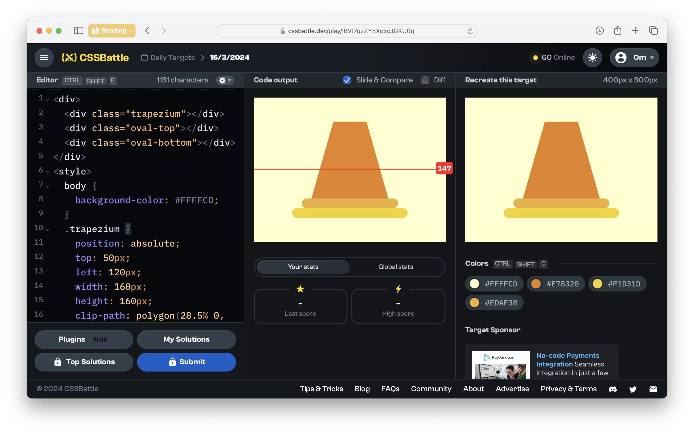

# CSSBattle Results - March 15, 2024

## Date: March 15, 2024

### Screenshots

#### Result Screen



#### CSS Photo


### HTML Code

```html
<div>
  <div class="trapezium"></div>
  <div class="oval-top"></div>
  <div class="oval-bottom"></div>
</div>
<style>
  body {
    background-color: #ffffcd;
  }
  .trapezium {
    position: absolute;
    top: 50px;
    left: 120px;
    width: 160px;
    height: 160px;
    clip-path: polygon(28.5% 0, 71.5% 0%, 100% 100%, 0 100%);
    background: #e78320;
  }
  .oval-top {
    position: absolute;
    top: 210px;
    left: 100px;
    width: 200px;
    height: 20px;
    border-radius: 75px;
    background: #edaf38;
  }
  .oval-bottom {
    position: absolute;
    top: 230px;
    left: 80px;
    width: 240px;
    height: 20px;
    border-radius: 75px;
    background: #f1d31d;
  }
</style>
```
