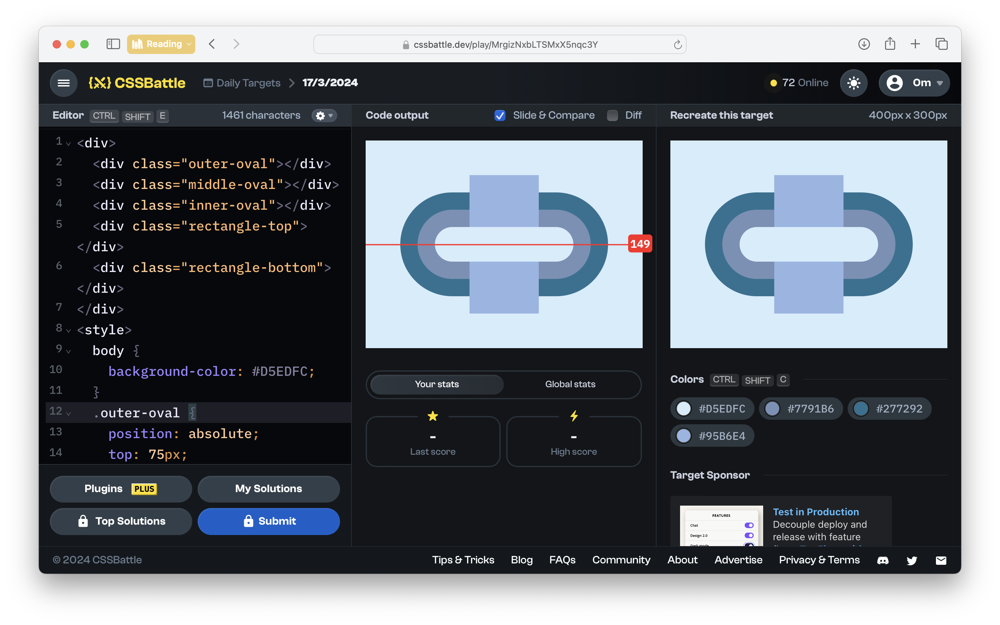
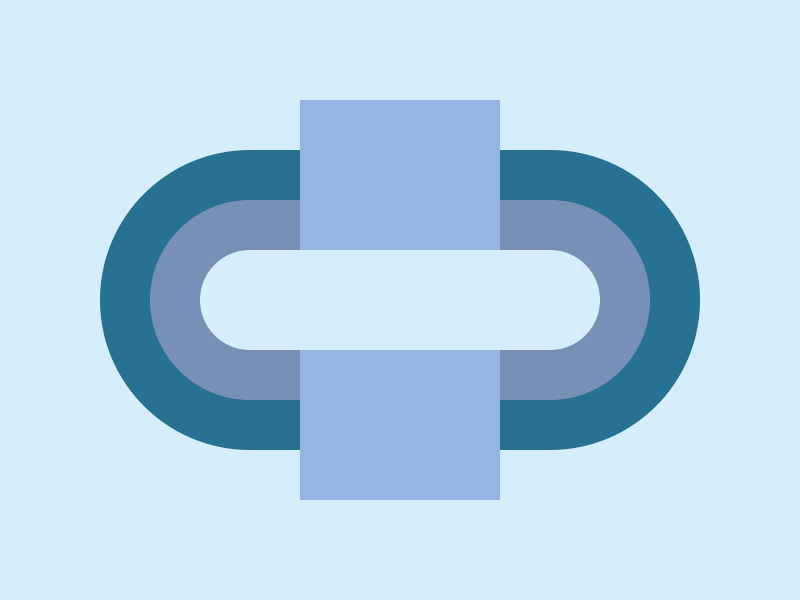

# CSSBattle Results - March 17, 2024

## Date: March 17, 2024

## Instructions

```html
<!-- OBJECTIVE -->
<!-- Write HTML/CSS in this editor and replicate the given target image in the least code possible. What you write here, renders as it is -->

<!-- SCORING -->
<!-- The score is calculated based on the number of characters you use (this comment included :P) and how close you replicate the image. Read the FAQS (https://cssbattle.dev/faqs) for more info. -->

<!-- IMPORTANT: remove the comments before submitting -->
```

### Screenshots

#### Result Screen



#### CSS Photo



### HTML Code

```html
<div>
  <div class="outer-oval"></div>
  <div class="middle-oval"></div>
  <div class="inner-oval"></div>
  <div class="rectangle-top"></div>
  <div class="rectangle-bottom"></div>
</div>
<style>
  body {
    background-color: #d5edfc;
  }
  .outer-oval {
    position: absolute;
    top: 75px;
    left: 50px;
    width: 300px;
    height: 150px;
    border-radius: 75px;
    background: #277292;
  }
  .middle-oval {
    position: absolute;
    top: 100px;
    left: 75px;
    width: 250px;
    height: 100px;
    border-radius: 75px;
    background: #7791b6;
  }
  .inner-oval {
    position: absolute;
    top: 125px;
    left: 100px;
    width: 200px;
    height: 50px;
    border-radius: 75px;
    background: #d5edfc;
  }
  .rectangle-top {
    position: absolute;
    top: 50px;
    left: 150px;
    width: 100px;
    height: 75px;
    background: #95b6e4;
  }
  .rectangle-bottom {
    position: absolute;
    bottom: 50px;
    left: 150px;
    width: 100px;
    height: 75px;
    background: #95b6e4;
  }
</style>
```
