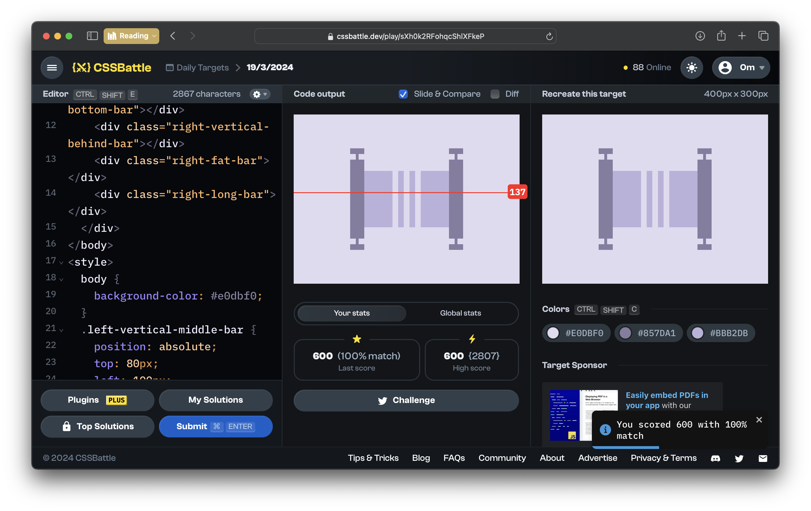
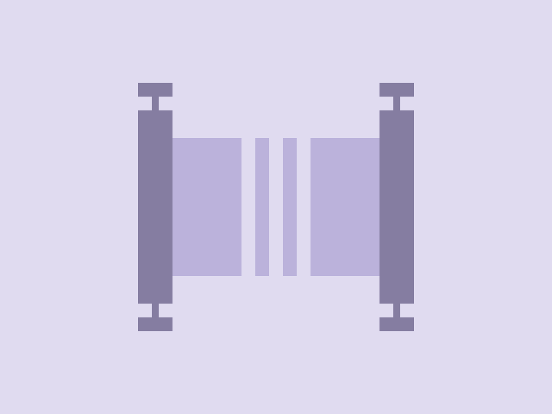

# CSSBattle Results - March 19, 2024

## Date: March 19, 2024

## Instructions

```html
<!-- OBJECTIVE -->
<!-- Write HTML/CSS in this editor and replicate the given target image in the least code possible. What you write here, renders as it is -->

<!-- SCORING -->
<!-- The score is calculated based on the number of characters you use (this comment included :P) and how close you replicate the image. Read the FAQS (https://cssbattle.dev/faqs) for more info. -->

<!-- IMPORTANT: remove the comments before submitting -->
```

### Screenshots

#### Result Screen



#### CSS Photo



### HTML Code

```html
<body>
  <div class="container">
    <div class="left-vertical-top-bar"></div>
    <div class="left-vertical-middle-bar"></div>
    <div class="left-vertical-bottom-bar"></div>
    <div class="left-vertical-behind-bar"></div>
    <div class="left-fat-bar"></div>
    <div class="left-long-bar"></div>
    <div class="right-vertical-top-bar"></div>
    <div class="right-vertical-middle-bar"></div>
    <div class="right-vertical-bottom-bar"></div>
    <div class="right-vertical-behind-bar"></div>
    <div class="right-fat-bar"></div>
    <div class="right-long-bar"></div>
  </div>
</body>
<style>
  body {
    background-color: #e0dbf0;
  }
  .left-vertical-middle-bar {
    position: absolute;
    top: 80px;
    left: 100px;
    width: 25px;
    height: 140px;
    background: #857da1;
  }
  .left-vertical-behind-bar {
    position: absolute;
    top: 60px;
    left: 110px;
    width: 5px;
    height: 180px;
    background: #857da1;
  }
  .left-vertical-top-bar {
    position: absolute;
    top: 60px;
    left: 100px;
    width: 25px;
    height: 10px;
    background: #857da1;
  }
  .left-vertical-bottom-bar {
    position: absolute;
    bottom: 60px;
    left: 100px;
    width: 25px;
    height: 10px;
    background: #857da1;
  }
  .right-vertical-middle-bar {
    position: absolute;
    top: 80px;
    right: 100px;
    width: 25px;
    height: 140px;
    background: #857da1;
  }
  .right-vertical-behind-bar {
    position: absolute;
    top: 60px;
    right: 110px;
    width: 5px;
    height: 180px;
    background: #857da1;
  }
  .right-vertical-top-bar {
    position: absolute;
    top: 60px;
    right: 100px;
    width: 25px;
    height: 10px;
    background: #857da1;
  }
  .right-vertical-bottom-bar {
    position: absolute;
    bottom: 60px;
    right: 100px;
    width: 25px;
    height: 10px;
    background: #857da1;
  }
  .left-fat-bar {
    position: absolute;
    top: 100px;
    left: 125px;
    width: 50px;
    height: 100px;
    background: #bbb2db;
  }
  .right-fat-bar {
    position: absolute;
    top: 100px;
    right: 125px;
    width: 50px;
    height: 100px;
    background: #bbb2db;
  }
  .left-long-bar {
    position: absolute;
    top: 100px;
    left: 185px;
    width: 10px;
    height: 100px;
    background: #bbb2db;
  }
  .right-long-bar {
    position: absolute;
    top: 100px;
    right: 185px;
    width: 10px;
    height: 100px;
    background: #bbb2db;
  }
</style>
```
