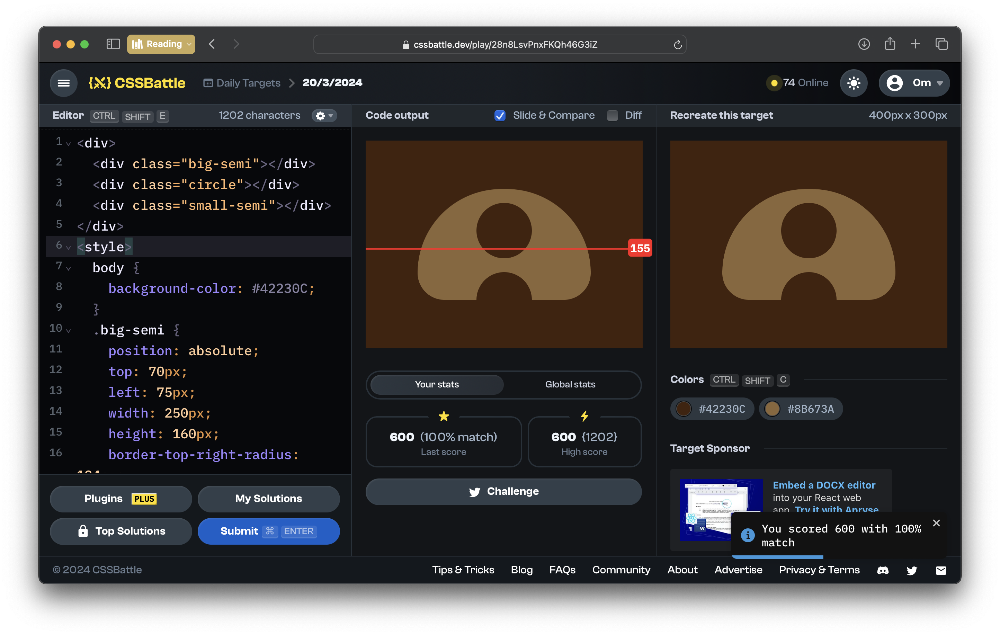
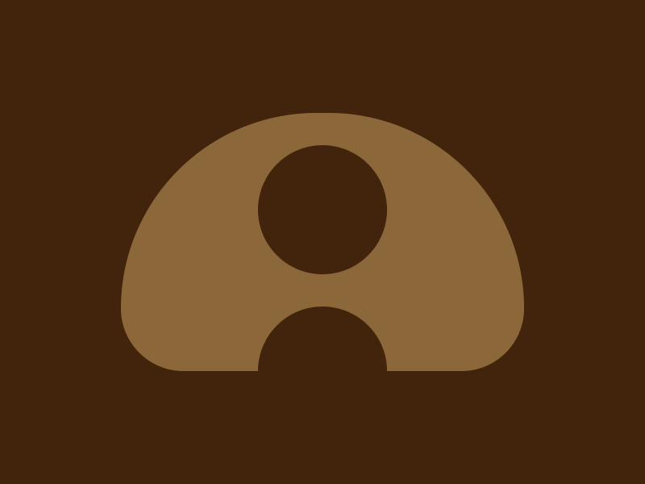

# CSSBattle Results - March 20, 2024

## Date: March 20, 2024

### Screenshots

#### Result Screen



#### CSS Photo



### HTML Code

```html
<div>
  <div class="big-semi"></div>
  <div class="circle"></div>
  <div class="small-semi"></div>
</div>
<style>
  body {
    background-color: #42230c;
  }
  .big-semi {
    position: absolute;
    top: 70px;
    left: 75px;
    width: 250px;
    height: 160px;
    border-top-right-radius: 124px;
    border-top-left-radius: 124px;
    border-bottom-left-radius: 40px;
    border-bottom-right-radius: 40px;
    background: #8b673a;
  }
  .circle {
    position: absolute;
    top: 90px;
    left: 160px;
    width: 80px;
    height: 80px;
    border-radius: 50%;
    background: #42230c;
  }
  .small-semi {
    position: absolute;
    top: 190px;
    left: 160px;
    width: 80px;
    height: 80px;
    border-radius: 50%;
    background: #42230c;
  }
</style>
```
