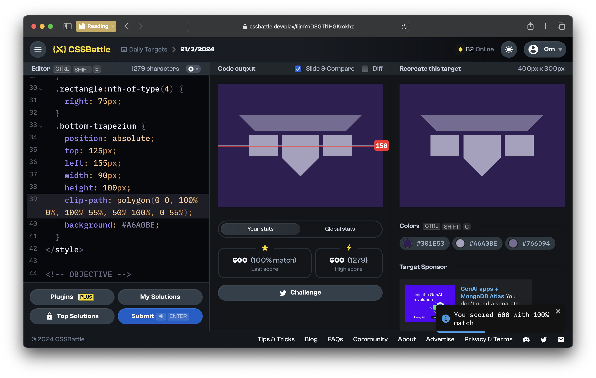
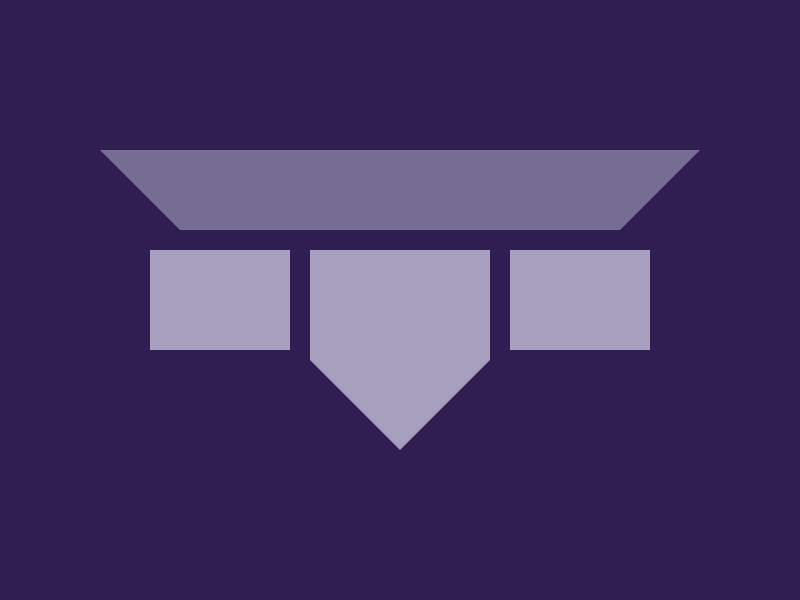

# CSSBattle Results - March 21, 2024

## Date: March 21, 2024

### Screenshots

#### Result Screen



#### CSS Photo



### HTML Code

```html
<div>
  <div class="top-trapezium"></div>
  <div class="bottom-trapezium"></div>
  <div class="rectangle"></div>
  <div class="rectangle"></div>
</div>
<style>
  body {
    background-color: #301e53;
  }
  .top-trapezium {
    position: absolute;
    top: 75px;
    left: 50px;
    width: 300px;
    height: 40px;
    clip-path: polygon(0 0, 100% 0, 86.7% 100%, 13.3% 100%);
    background: #766d94;
  }
  .rectangle {
    position: absolute;
    top: 125px;
    width: 70px;
    height: 50px;
    background: #a6a0be;
  }
  .rectangle:nth-of-type(3) {
    left: 75px;
  }
  .rectangle:nth-of-type(4) {
    right: 75px;
  }
  .bottom-trapezium {
    position: absolute;
    top: 125px;
    left: 155px;
    width: 90px;
    height: 100px;
    clip-path: polygon(0 0, 100% 0%, 100% 55%, 50% 100%, 0 55%);
    background: #a6a0be;
  }
</style>
```
