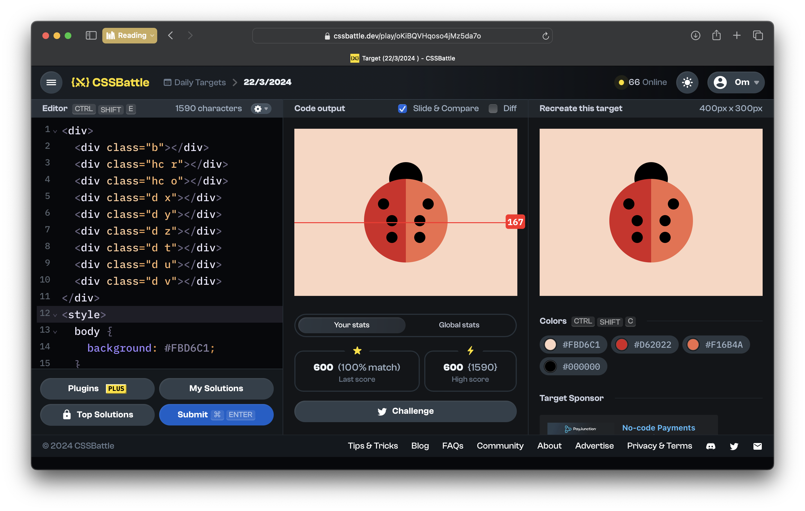
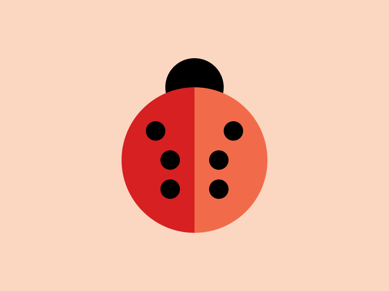

# CSSBattle Results - March 22, 2024

## Date: March 22, 2024

## Instructions

```html
<!-- OBJECTIVE -->
<!-- Write HTML/CSS in this editor and replicate the given target image in the least code possible. What you write here, renders as it is -->

<!-- SCORING -->
<!-- The score is calculated based on the number of characters you use (this comment included :P) and how close you replicate the image. Read the FAQS (https://cssbattle.dev/faqs) for more info. -->

<!-- IMPORTANT: remove the comments before submitting -->
```

### Screenshots

#### Result Screen



#### CSS Photo



### HTML Code

```html
<div>
  <div class="b"></div>
  <div class="hc r"></div>
  <div class="hc o"></div>
  <div class="d x"></div>
  <div class="d y"></div>
  <div class="d z"></div>
  <div class="d t"></div>
  <div class="d u"></div>
  <div class="d v"></div>
</div>
<style>
  body {
    background: #fbd6c1;
  }
  .b {
    position: absolute;
    top: 60px;
    left: 170px;
    width: 60px;
    height: 60px;
    border-radius: 50px;
    background: #000000;
  }
  .hc {
    position: absolute;
    width: 75px;
    height: 150px;
    border-top-left-radius: 80px;
    border-bottom-left-radius: 80px;
  }
  .r {
    top: 90px;
    left: 125px;
    background: #d62022;
  }
  .o {
    top: 90px;
    right: 125px;
    transform: rotate(180deg);
    background: #f16b4a;
  }

  .d {
    position: absolute;
    width: 20px;
    height: 20px;
    border-radius: 50px;
    background: #000000;
  }
  .x {
    top: 125px;
    left: 150px;
  }
  .y {
    top: 155px;
    left: 165px;
  }
  .z {
    top: 185px;
    left: 165px;
  }
  .t {
    top: 125px;
    right: 150px;
  }
  .u {
    top: 155px;
    right: 165px;
  }
  .v {
    top: 185px;
    right: 165px;
  }
</style>
```
