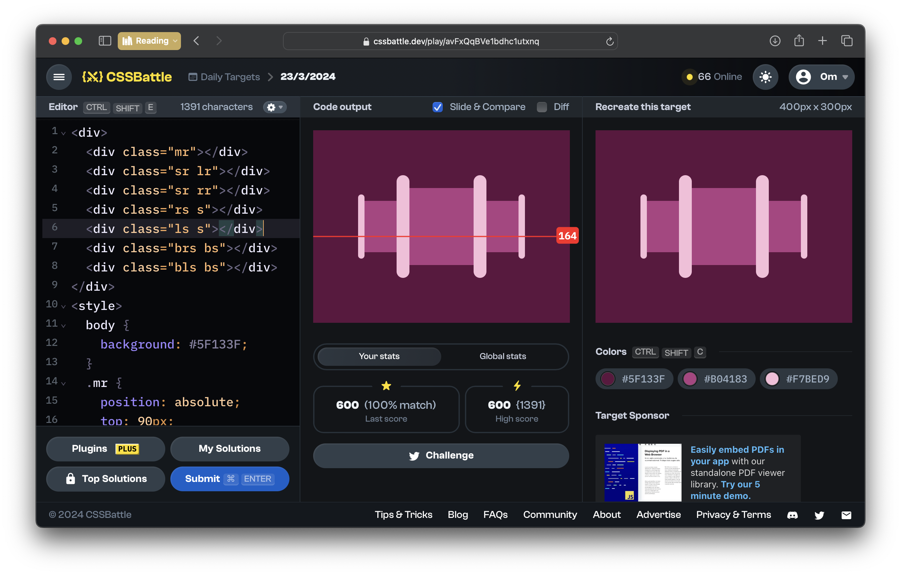
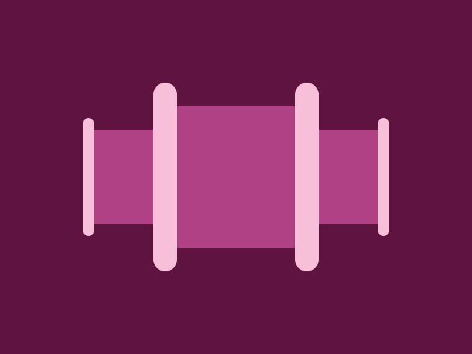

# CSSBattle Results - March 23, 2024

## Date: March 23, 2024

### Screenshots

#### Result Screen



#### CSS Photo



### HTML Code

```html
<div>
  <div class="mr"></div>
  <div class="sr lr"></div>
  <div class="sr rr"></div>
  <div class="rs s"></div>
  <div class="ls s"></div>
  <div class="brs bs"></div>
  <div class="bls bs"></div>
</div>
<style>
  body {
    background: #5f133f;
  }
  .mr {
    position: absolute;
    top: 90px;
    left: 150px;
    width: 100px;
    height: 120px;
    background: #b04183;
  }

  .sr {
    position: absolute;
    top: 110px;
    width: 50px;
    height: 80px;
    background: #b04183;
  }
  .lr {
    left: 80px;
  }

  .rr {
    right: 80px;
  }

  .bs {
    position: absolute;
    top: 70px;
    width: 20px;
    height: 160px;
    border-radius: 20px;
    background: #f7bed9;
  }
  .bls {
    left: 130px;
  }
  .brs {
    right: 130px;
  }
  .s {
    position: absolute;
    top: 100px;
    width: 10px;
    height: 100px;
    border-radius: 20px;
    background: #f7bed9;
  }
  .ls {
    left: 70px;
  }
  .rs {
    right: 70px;
  }
</style>
```
