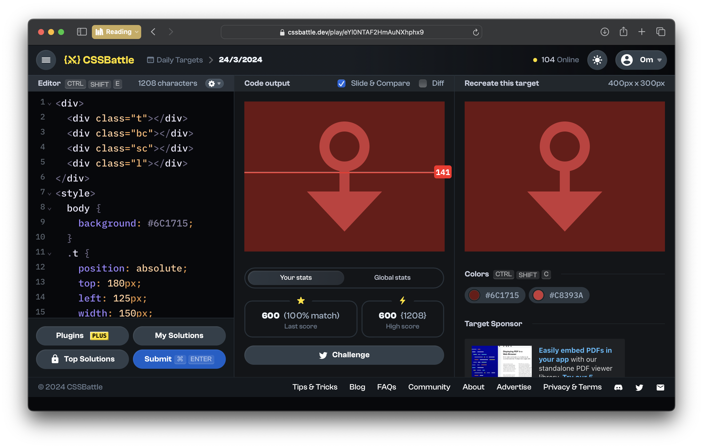

# CSSBattle Results - March 24, 2024

## Date: March 24, 2024

### Screenshots

#### Result Screen



#### CSS Photo


### HTML Code

```html
<div>
  <div class="t"></div>
  <div class="bc"></div>
  <div class="sc"></div>
  <div class="l"></div>
</div>
<style>
  body {
    background: #6c1715;
  }
  .t {
    position: absolute;
    top: 180px;
    left: 125px;
    width: 150px;
    height: 80px;
    clip-path: polygon(50% 100%, 0 0, 100% 0);
    background: #c8393a;
  }
  .bc {
    position: absolute;
    top: 40px;
    left: 150px;
    width: 100px;
    height: 100px;
    border-radius: 50%;
    background: #c8393a;
  }
  .sc {
    position: absolute;
    top: 60px;
    left: 170px;
    width: 60px;
    height: 60px;
    border-radius: 50%;
    background: #6c1715;
  }
  .l {
    position: absolute;
    top: 130px;
    left: 190px;
    width: 20px;
    height: 60px;
    background: #c8393a;
  }
</style>
```
