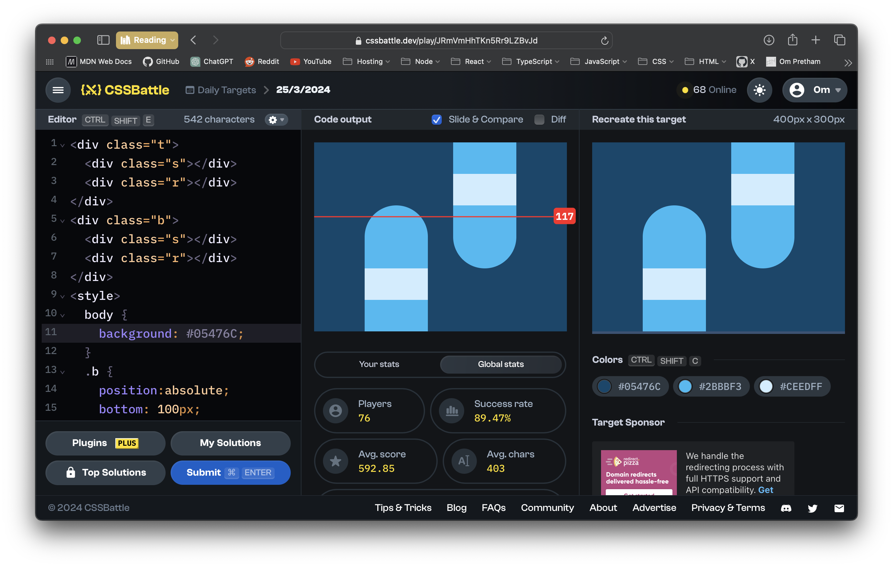

# CSSBattle Results - March 25, 2024

## Date: March 25, 2024

## Instructions

```html
<!-- OBJECTIVE -->
<!-- Write HTML/CSS in this editor and replicate the given target image in the least code possible. What you write here, renders as it is -->

<!-- SCORING -->
<!-- The score is calculated based on the number of characters you use (this comment included :P) and how close you replicate the image. Read the FAQS (https://cssbattle.dev/faqs) for more info. -->

<!-- IMPORTANT: remove the comments before submitting -->
```

### Screenshots

#### Result Screen



#### CSS Photo


### HTML Code

```html
<div class="t">
  <div class="s"></div>
  <div class="r"></div>
</div>
<div class="b">
  <div class="s"></div>
  <div class="r"></div>
</div>
<style>
  body {
    background: #05476c;
  }
  .b {
    position: absolute;
    bottom: 100px;
    right: 80px;
  }
  .t {
    position: absolute;
    top: 100px;
    left: 80px;
  }
  .s {
    border-radius: 50px;
    width: 100px;
    height: 250px;
    background: #2bbbf3;
  }
  .r {
    position: absolute;
    top: 100px;
    width: 100px;
    height: 50px;
    background: #ceedff;
  }
</style>
```
