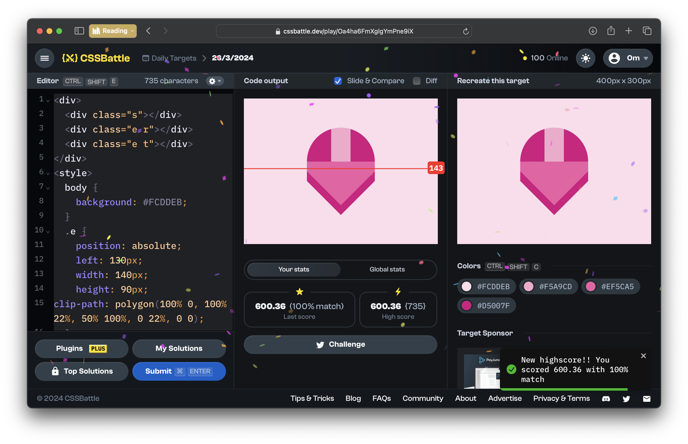
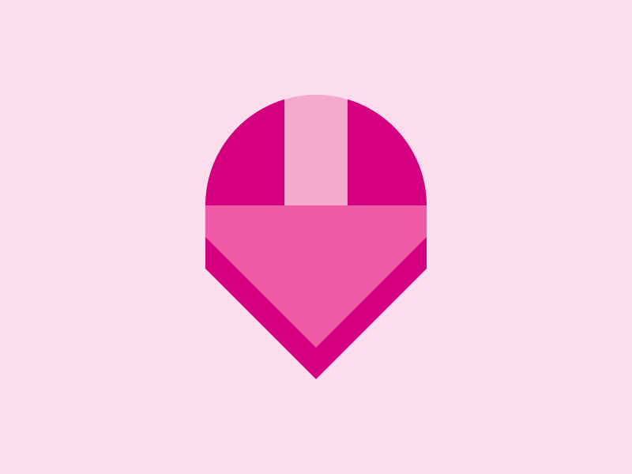

# CSSBattle Results - March 26, 2024

## Date: March 26, 2024

## Instructions

```html
<!-- OBJECTIVE -->
<!-- Write HTML/CSS in this editor and replicate the given target image in the least code possible. What you write here, renders as it is -->

<!-- SCORING -->
<!-- The score is calculated based on the number of characters you use (this comment included :P) and how close you replicate the image. Read the FAQS (https://cssbattle.dev/faqs) for more info. -->

<!-- IMPORTANT: remove the comments before submitting -->
```

### Screenshots

#### Result Screen



#### CSS Photo



### HTML Code

```html
<div>
  <div class="s"></div>
  <div class="e r"></div>
  <div class="e t"></div>
</div>
<style>
  body {
    background: #fcddeb;
  }
  .e {
    position: absolute;
    left: 130px;
    width: 140px;
    height: 90px;
    clip-path: polygon(100% 0, 100% 22%, 50% 100%, 0 22%, 0 0);
  }
  .s {
    position: absolute;
    top: 60px;
    left: 130px;
    width: 140px;
    height: 180px;
    border-top-left-radius: 70px;
    border-top-right-radius: 70px;
    clip-path: polygon(
      100% 0,
      100% 34%,
      100% 61.1%,
      50% 100%,
      0 61.1%,
      0 33%,
      0 0
    );
    background: linear-gradient(
      90deg,
      #d5007f 35.6%,
      #f5a9cd 0 64.4%,
      #d5007f 0
    );
  }
  .t {
    top: 130px;
    background: #ef5ca5;
  }
  .r {
    top: 150px;
    background: #d5007f;
  }
</style>
```
