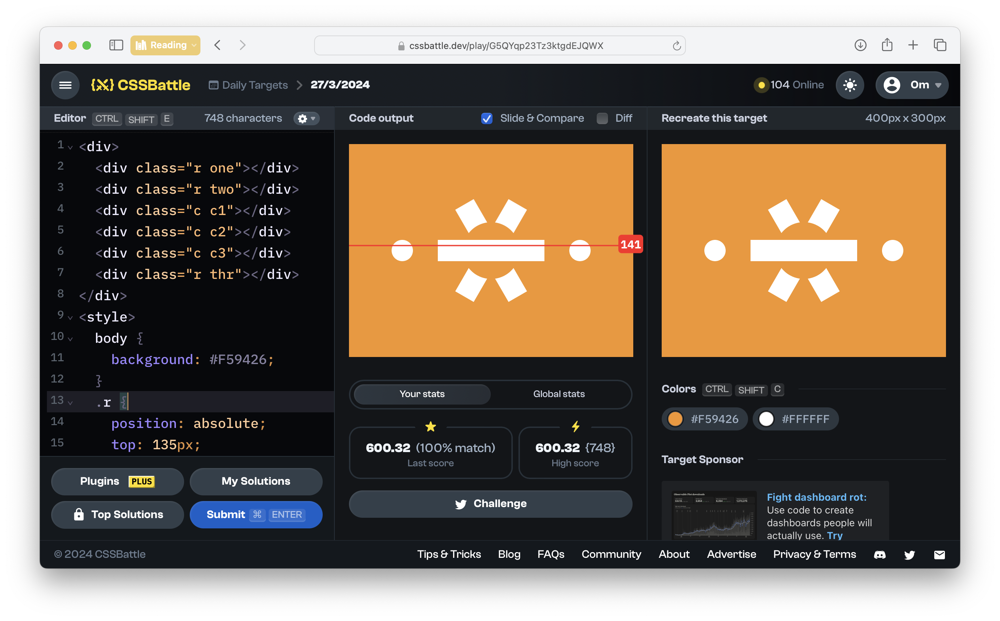
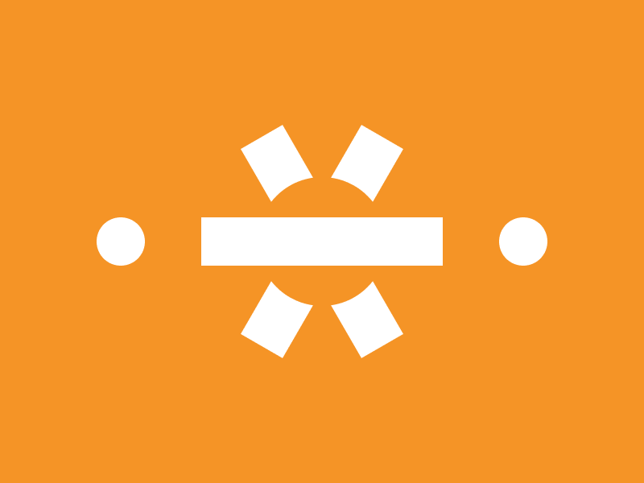

# CSSBattle Results - March 27, 2024

## Date: March 27, 2024

## Instructions

```html
<!-- OBJECTIVE -->
<!-- Write HTML/CSS in this editor and replicate the given target image in the least code possible. What you write here, renders as it is -->

<!-- SCORING -->
<!-- The score is calculated based on the number of characters you use (this comment included :P) and how close you replicate the image. Read the FAQS (https://cssbattle.dev/faqs) for more info. -->

<!-- IMPORTANT: remove the comments before submitting -->
```

### Screenshots

#### Result Screen



#### CSS Photo



### HTML Code

```html
<div>
  <div class="r one"></div>
  <div class="r two"></div>
  <div class="c c1"></div>
  <div class="c c2"></div>
  <div class="c c3"></div>
  <div class="r thr"></div>
</div>
<style>
  body {
    background: #f59426;
  }
  .r {
    position: absolute;
    top: 135px;
    left: 125px;
    width: 150px;
    height: 30px;
    background: #ffffff;
  }
  .one {
    rotate: 120deg;
  }
  .two {
    rotate: -120deg;
  }
  .c {
    position: absolute;
    width: 30px;
    height: 30px;
    border-radius: 50%;
  }
  .c1 {
    top: 135px;
    left: 60px;
    background: #ffffff;
  }
  .c2 {
    top: 135px;
    right: 60px;
    background: #ffffff;
  }
  .c3 {
    top: 135px;
    left: 185px;
    scale: 2.66;
    background: #f59426;
  }
</style>
```
