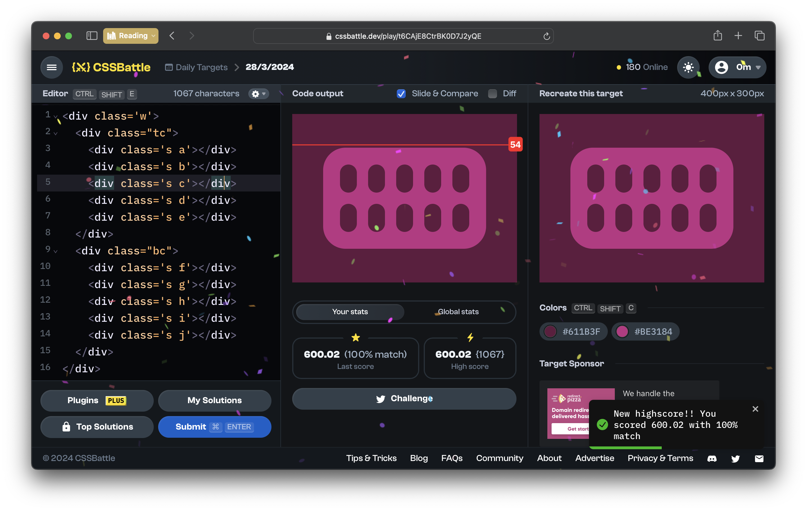

# CSSBattle Results - March 28, 2024

## Date: March 28, 2024

## Instructions

```html
<!-- OBJECTIVE -->
<!-- Write HTML/CSS in this editor and replicate the given target image in the least code possible. What you write here, renders as it is -->

<!-- SCORING -->
<!-- The score is calculated based on the number of characters you use (this comment included :P) and how close you replicate the image. Read the FAQS (https://cssbattle.dev/faqs) for more info. -->

<!-- IMPORTANT: remove the comments before submitting -->
```

### Screenshots

#### Result Screen



#### CSS Photo


### HTML Code

```html
<div class="w">
  <div class="tc">
    <div class="s a"></div>
    <div class="s b"></div>
    <div class="s c"></div>
    <div class="s d"></div>
    <div class="s e"></div>
  </div>
  <div class="bc">
    <div class="s f"></div>
    <div class="s g"></div>
    <div class="s h"></div>
    <div class="s i"></div>
    <div class="s j"></div>
  </div>
</div>
<style>
  body {
    background: #611b3f;
  }
  .w {
    position: absolute;
    top: 60px;
    left: 55px;
    width: 290px;
    height: 180px;
    border-radius: 40px;
    background: #be3184;
  }
  .s {
    position: absolute;
    width: 30px;
    height: 50px;
    border-radius: 20px;
    background: #611b3f;
  }
  .tc {
    position: absolute;
    top: 30px;
  }
  .a {
    left: 30px;
  }
  .b {
    left: 80px;
  }
  .c {
    left: 130px;
  }
  .d {
    left: 180px;
  }
  .e {
    left: 230px;
  }
  .bc {
    position: absolute;
    bottom: 80px;
  }
  .f {
    left: 30px;
  }
  .g {
    left: 80px;
  }
  .h {
    left: 130px;
  }
  .i {
    left: 180px;
  }
  .j {
    left: 230px;
  }
</style>
```
