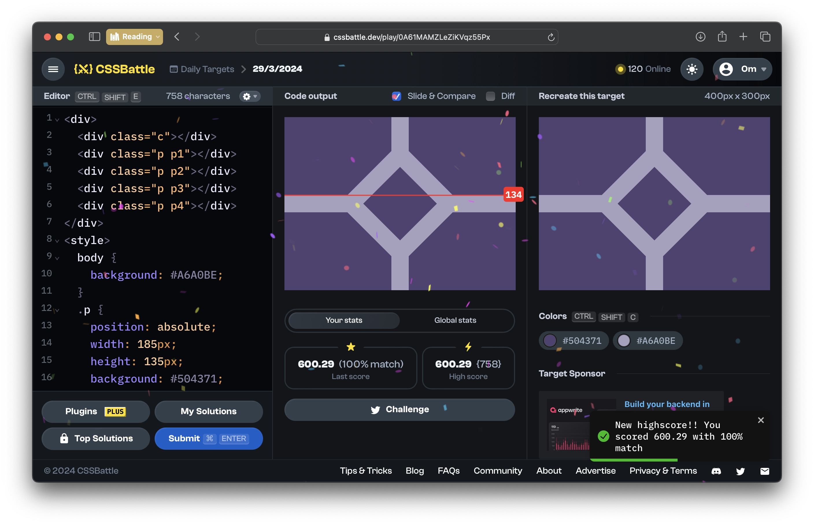
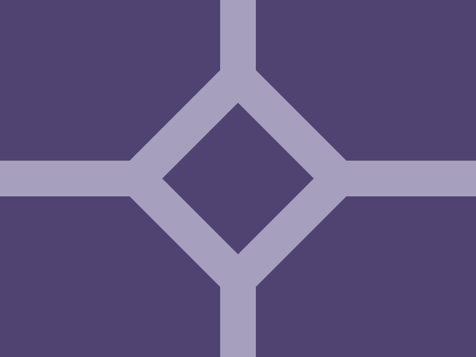

# CSSBattle Results - March 29, 2024

## Date: March 29, 2024

## Instructions

```html
<!-- OBJECTIVE -->
<!-- Write HTML/CSS in this editor and replicate the given target image in the least code possible. What you write here, renders as it is -->

<!-- SCORING -->
<!-- The score is calculated based on the number of characters you use (this comment included :P) and how close you replicate the image. Read the FAQS (https://cssbattle.dev/faqs) for more info. -->

<!-- IMPORTANT: remove the comments before submitting -->
```

### Screenshots

#### Result Screen



#### CSS Photo



### HTML Code

```html
<div>
  <div class="c"></div>
  <div class="p p1"></div>
  <div class="p p2"></div>
  <div class="p p3"></div>
  <div class="p p4"></div>
</div>
<style>
  body {
    background: #a6a0be;
  }
  .p {
    position: absolute;
    width: 185px;
    height: 135px;
    background: #504371;
    clip-path: polygon(100% 0, 100% 43.5%, 59% 100%, 0 100%, 0 0);
  }
  .p1 {
    top: 0;
    left: 0;
  }
  .p2 {
    top: 0;
    right: 0;
    transform: scaleX(-1);
  }
  .p3 {
    bottom: 0;
    left: 0;
    transform: scaleY(-1);
  }
  .p4 {
    bottom: 0;
    right: 0;
    transform: scaleX(-1) scaleY(-1);
  }
  .c {
    position: absolute;
    top: 105px;
    left: 155px;
    width: 90px;
    height: 90px;
    background: #504371;
    rotate: 45deg;
  }
</style>
```
