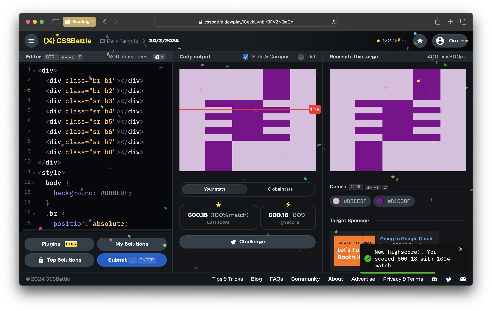
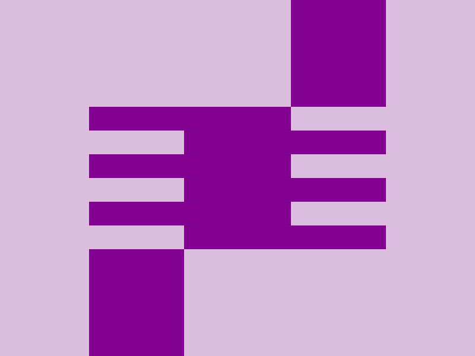

# CSSBattle Results - March 30, 2024

## Date: March 30, 2024

## Instructions

```html
<!-- OBJECTIVE -->
<!-- Write HTML/CSS in this editor and replicate the given target image in the least code possible. What you write here, renders as it is -->

<!-- SCORING -->
<!-- The score is calculated based on the number of characters you use (this comment included :P) and how close you replicate the image. Read the FAQS (https://cssbattle.dev/faqs) for more info. -->

<!-- IMPORTANT: remove the comments before submitting -->
```

### Screenshots

#### Result Screen



#### CSS Photo



### HTML Code

```html
<div>
  <div class="br b1"></div>
  <div class="br b2"></div>
  <div class="sr b3"></div>
  <div class="sr b4"></div>
  <div class="sr b5"></div>
  <div class="sr b6"></div>
  <div class="sr b7"></div>
  <div class="sr b8"></div>
</div>
<style>
  body {
    background: #dbbedf;
  }
  .br {
    position: absolute;
    width: 80px;
    height: 90px;
    background: #81008f;
  }
  .b1 {
    bottom: 0;
    left: 75;
  }
  .b2 {
    top: 0;
    right: 75;
  }
  .sr {
    position: absolute;
    width: 170px;
    height: 20px;
    background: #81008f;
  }

  .b3 {
    top: 90;
    left: 75;
  }
  .b4 {
    top: 130;
    left: 75;
  }
  .b5 {
    top: 170;
    left: 75;
  }
  .b6 {
    top: 110;
    right: 75;
  }
  .b7 {
    top: 150;
    right: 75;
  }
  .b8 {
    top: 190;
    right: 75;
  }
</style>
```
