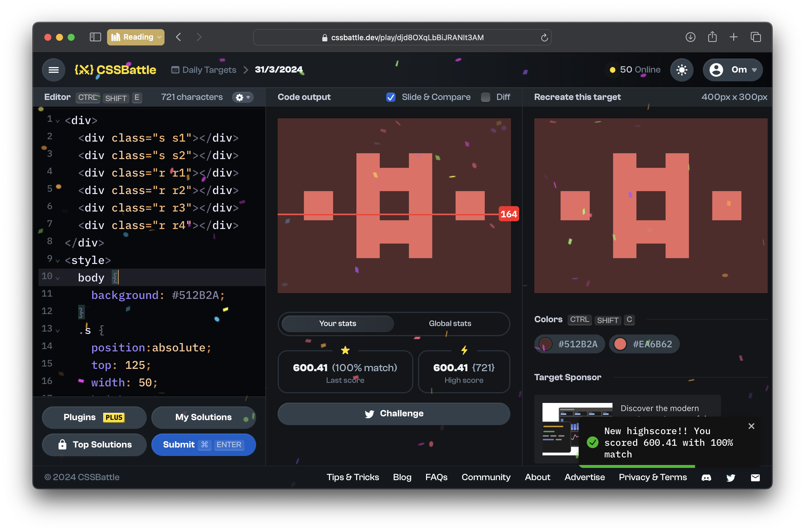

# CSSBattle Results - March 31, 2024

## Date: March 31, 2024

## Instructions

```html
<!-- OBJECTIVE -->
<!-- Write HTML/CSS in this editor and replicate the given target image in the least code possible. What you write here, renders as it is -->

<!-- SCORING -->
<!-- The score is calculated based on the number of characters you use (this comment included :P) and how close you replicate the image. Read the FAQS (https://cssbattle.dev/faqs) for more info. -->

<!-- IMPORTANT: remove the comments before submitting -->
```

### Screenshots

#### Result Screen



#### CSS Photo


### HTML Code

```html
<div>
  <div class="s s1"></div>
  <div class="s s2"></div>
  <div class="r r1"></div>
  <div class="r r2"></div>
  <div class="r r3"></div>
  <div class="r r4"></div>
</div>
<style>
  body {
    background: #512b2a;
  }
  .s {
    position: absolute;
    top: 125;
    width: 50;
    height: 50;
    background: #ea6b62;
  }
  .s1 {
    left: 45;
  }
  .s2 {
    right: 45;
  }
  .r {
    position: absolute;
    width: 40;
    height: 180;
    background: #ea6b62;
  }
  .r1 {
    top: 60;
    left: 135;
  }
  .r2 {
    top: 60;
    right: 135;
  }
  .r3 {
    height: 130;
    rotate: 90deg;
    top: 40;
    right: 180;
  }
  .r4 {
    height: 130;
    rotate: 90deg;
    bottom: 40;
    right: 180;
  }
</style>
```
