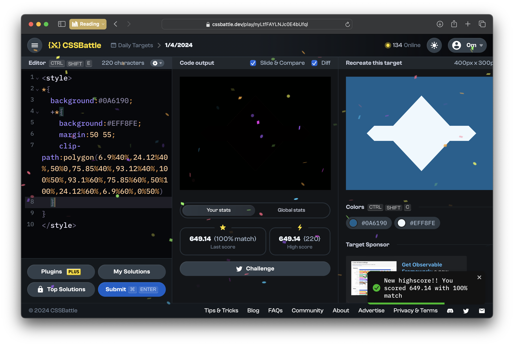
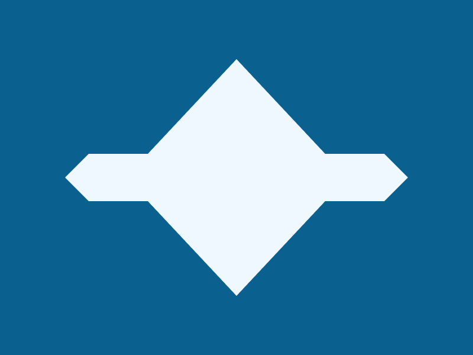

# CSSBattle Results - April 01, 2024

## Date: April 01, 2024

## Instructions

```html
<!-- OBJECTIVE -->
<!-- Write HTML/CSS in this editor and replicate the given target image in the least code possible. What you write here, renders as it is -->

<!-- SCORING -->
<!-- The score is calculated based on the number of characters you use (this comment included :P) and how close you replicate the image. Read the FAQS (https://cssbattle.dev/faqs) for more info. -->

<!-- IMPORTANT: remove the comments before submitting -->
```

### Screenshots

#### Result Screen



#### CSS Photo



### HTML Code

```html
<style>
  * {
    background: #0a6190;
    + * {
      background: #eff8fe;
      margin: 50 55;
      clip-path: polygon(
        6.9%40%,
        24.12%40%,
        50%0,
        75.85%40%,
        93.12%40%,
        100%50%,
        93.1%60%,
        75.85%60%,
        50%100%,
        24.12%60%,
        6.9%60%,
        0%50%
      );
    }
  }
</style>
```
