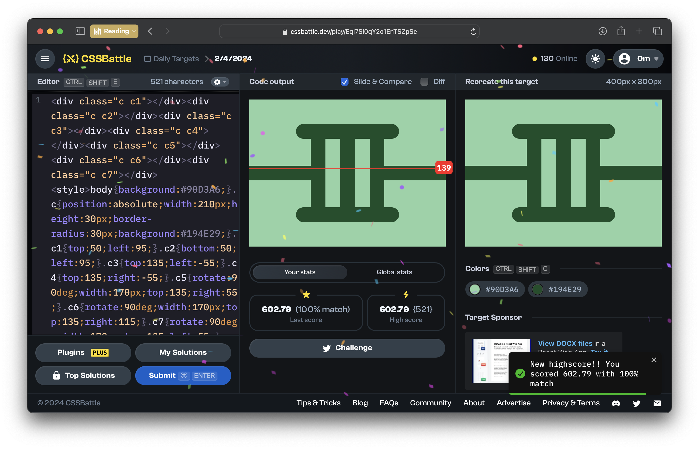
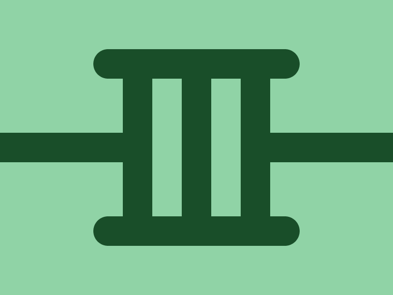

# CSSBattle Results - April 02, 2024

## Date: April 02, 2024

## Instructions

```html
<!-- OBJECTIVE -->
<!-- Write HTML/CSS in this editor and replicate the given target image in the least code possible. What you write here, renders as it is -->

<!-- SCORING -->
<!-- The score is calculated based on the number of characters you use (this comment included :P) and how close you replicate the image. Read the FAQS (https://cssbattle.dev/faqs) for more info. -->

<!-- IMPORTANT: remove the comments before submitting -->
```

### Screenshots

#### Result Screen



#### CSS Photo



### HTML Code

```html
<div class="c c1"></div>
<div class="c c2"></div>
<div class="c c3"></div>
<div class="c c4"></div>
<div class="c c5"></div>
<div class="c c6"></div>
<div class="c c7"></div>
<style>
  body {
    background: #90d3a6;
  }
  .c {
    position: absolute;
    width: 210px;
    height: 30px;
    border-radius: 30px;
    background: #194e29;
  }
  .c1 {
    top: 50;
    left: 95;
  }
  .c2 {
    bottom: 50;
    left: 95;
  }
  .c3 {
    top: 135;
    left: -55;
  }
  .c4 {
    top: 135;
    right: -55;
  }
  .c5 {
    rotate: 90deg;
    width: 170px;
    top: 135;
    right: 55;
  }
  .c6 {
    rotate: 90deg;
    width: 170px;
    top: 135;
    right: 115;
  }
  .c7 {
    rotate: 90deg;
    width: 170px;
    top: 135;
    left: 55;
  }
</style>
```
